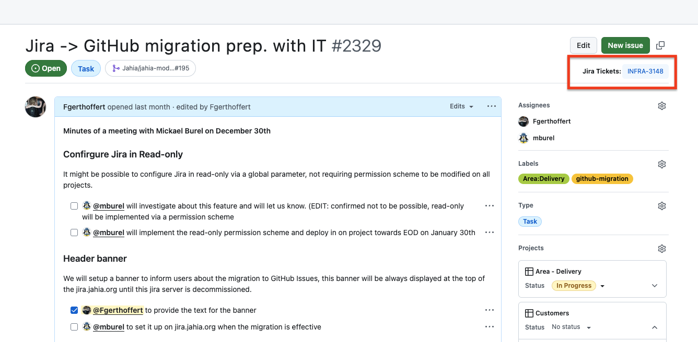

This folder contains tools and scripts useful when using GitHub

### tampermonkey-support-tickets.js

After installer the Chrome Extension "Tampermonkey", this script will build links to Jira tickets from the "Jira tickets" field in the Customers project.

To install:
 - Install Tampermonkey chrome extension
 - Click on the "+" to add an extension
 - Copy/paste the content of the file.

Troubleshooting:
- I installed Tampermonkey and added the script, but it's not running.
Ensure you enabled "Developer mode" under Google Chrome --> Extensions - Manage Extensions
(You might need to restart your browser to make it effective.)

