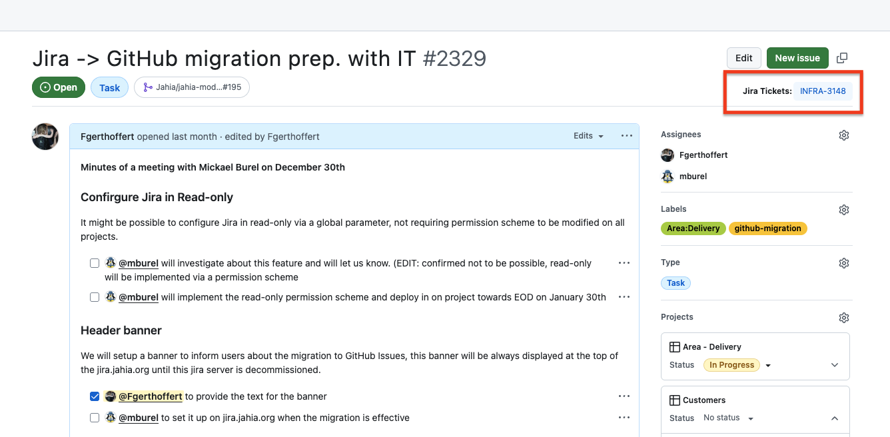

This folder contains tools and scripts useful when using GitHub

### tampermonkey-support-tickets.js

After installer the Chrome Extension "Tampermonkey", this script will build links to Jira tickets from the "Jira tickets" field in the Customers project.



To install:
 - Install Tampermonkey chrome extension
 - Click on the "+" to add an extension
 - Copy/paste the content of the file.

Troubleshooting:
- I installed Tampermonkey and added the script, but it's not running.
Ensure you enabled "Developer mode" under Google Chrome --> Extensions - Manage Extensions
(You might need to restart your browser to make it effective.)


### GitHub Issues notifications

Although we do strongly recommend the use of Scheduled Reminders in GitHub, this only works for Pull Requests. Meaning notifications about `@mention` in GitHub Issues will not trigger notifications in Slack.

To cover for that missing feature, you can setup a workflow that will act like Scheduled reminder.

Begin by:
 - Creating a GitHub Personal Access Token (using **classic** tokens), only give this token the **notifications** scope
 - Contact your Delivery Manager, who will be adding the token to https://github.com/Jahia/delivery under the variable GH_NOTIFICATIONS_[USERNAME]
 - Identify your Slack User ID (right click on your username in Slack, then "View profile", click on the vertical dots, and "Copy member ID")
 - Open-up a PR in the https://github.com/Jahia/delivery repository to create your own notifications workflow. Its name should be "notifications-[USERNAME].yml", you can use the following workflow as an inspiration.

 Note that you can pick between two type of behavior:
  - A message containing all notifications since the last time it was executed, this fits well when you are primariraly interested in reviewing multiple notifications at once.
  - A message containing only one notification at a time, this fits well if you're looking more for a "real-time" notification style (although this will not be real time).

Be mindful of resource usage, even if this workflows takes less than 10s to run, on the smallest available machines, we should be cautious to not over-consume resources.

More details about options are available here: https://github.com/Fgerthoffert/actions-issues-notifications

```yaml
name: Notifications (fgerthoffert)

on:
  schedule:
    # Every hour during extended working hours (7 AM - 8 PM UTC, Mon-Fri)
    - cron: '0 7-20 * * 1-5'
  workflow_dispatch:
    inputs:
      slack_channel:
        description: "Slack channel or user ID to send the notification to (e.g., #channel or U01234567)"
        required: true
        type: string

jobs:
  notifications:
    runs-on: ubuntu-slim

    steps:
      - uses: fgerthoffert/actions-issues-notifications@v1.0.2
        id: issues-notifications
        with:
          github_token: ${{ secrets.GITHUB_NOTIFICATIONS_FGERTHOFFERT }}
          max_notifications: '1'
          notification_action: 'done'

      - name: Send Slack Notification
        uses: slackapi/slack-github-action@v2.1.1
        with:
          method: chat.postMessage
          token: ${{ secrets.SLACK_BOT_TOKEN }}
          payload: |
            {
              "channel": "${{ inputs.slack_channel || 'ULE1PJ3S5' }}",
              "text": ${{ toJSON(steps.issues-notifications.outputs.message) }}
            }

```
